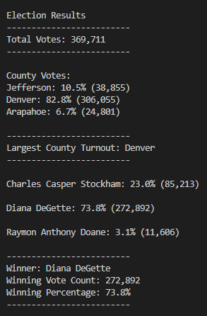
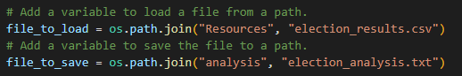
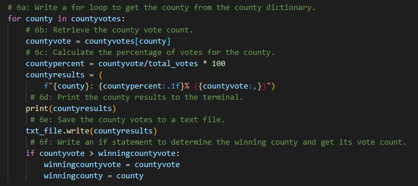

# Election Audit Analysis

## Overview of Election Audit
The purpose of this election audit analysis is to collect data requested by the Colorado Election Commission. The information previously collected by the commission was total number of votes cast, total number of votes for each candidate, percentage of votes for each candidate, and winner of the election based on the popular vote.

However, the election audit analysis was extended to collect additional information: voter turnout for each county, percentage of votes from each county of the total count, and county with the highest turnout. 

A previous analysis reported the following information: 

## Election-Audit Results
After a lengthy process of cleaning and organizing the election data using python programming language, the results are as followed:

- The total votes cast in this congressional election was 369,711. 

- A breakdown of the number of votes and the percentage of total votes for each county in the precinct is as follows: 
    - Jefferson, with a total of 38,855 votes and 10.5% of total number of votes.
    - Denver, with a total of 306,055 votes and 82.8% of total number of votes.
    - Arapahoe, with a total of 24,801 votes and 6.7% of total number of votes.

- The county that has the largest number of votes is Denver.

- Below is a breakdown of the number of votes and the percentage of the total votes each candidate received:
    - Charles Casper Stockham: 85,213 total votes and 23.00% of total votes.
    - Diana DeGette: 272,892 total votes and 73.8% of total votes.
    - Raymon Anthony Doane: 11,606 total votes and 3.1% of total votes.

- The WINNER of this election is Diana DeGette. Diana had a vote count of 272,892. The percentage of total votes was 73.8%. 

## Election-Audit Summary
The Election Audit Analysis has provided the Colorado Election Commission with a thorough analysis of the election data provided. Two examples of how this scripted can be modified to be used for other elections would be for the use of another dataset (CSV or other tabular file) and a change in election region, such as city or state.

The customized script can be used with any tabular dataset. The auditor would have to make a change in the data source, ("Resources", "election_results.csv"), and upload the desired text file to the code script, as seen below. 

Furthermore, another way script can be modified to be used for another election, would be to change the election region. The county variable names can be modified to fit the given election.

